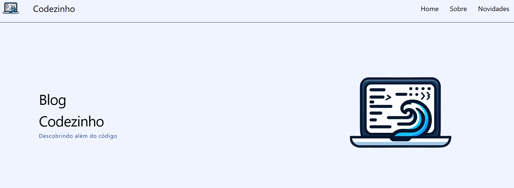

# Blog

  

> Fiz esse projeto para praticar Tailwind

## ⚙️ Ajustes e melhorias

O projeto ainda está em desenvolvimento e as próximas atualizações serão voltadas para as seguintes tarefas:

- [x] Adicionar mais animações
- [x] Acrescentar mais funcionalidades com Java Script
- [x] Criar mais páginas
- [x] Adicionar Dark mode

## 💻 Linguagens

## 📝 Liçencas 
<ul> 
  <li> As imagens utilizadas neste projeto foram obtidas no <a href="https://pixabay.com/">Pixabay</a> , <a href="https://www.pexels.com/pt-br/">Pexels</a> e <a href="https://commons.wikimedia.org/wiki/Main_Page">Wikimedia commons</a></li>
</ul>

